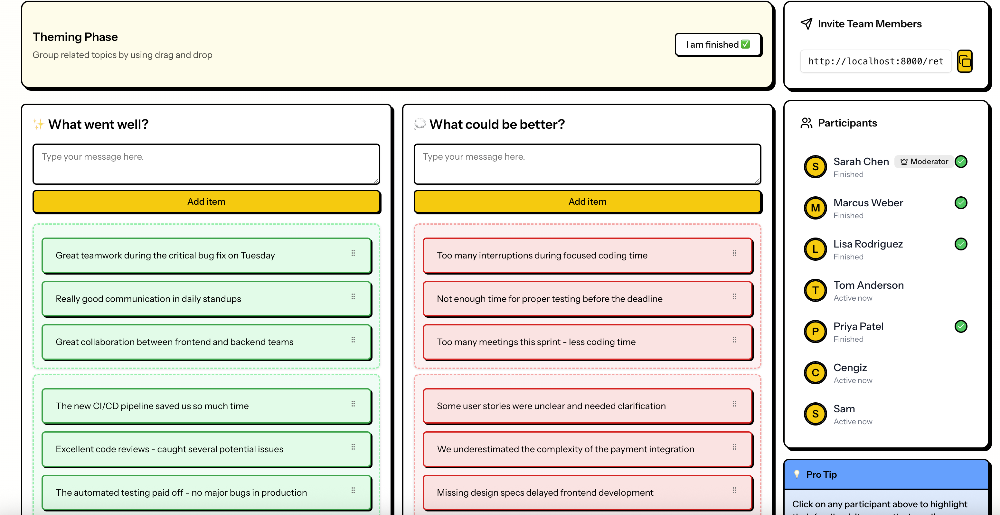

# 🚀 Fast Retro

**Retrospectives made fast** - An open source retrospective tool for agile teams.

[](https://opensource.org/licenses/MIT)
[](https://github.com/JangoCG/fastretro/stargazers)
[](https://github.com/JangoCG/fastretro/issues)



## 🌟 Why Fast Retro?

Dreading your next retro again? Cringe icebreakers, pointless fluff and going overtime (again)? Yeah, same here. That's
why we built Fast Retro: Wrap up your next retro fast, getting actionable results and get back to work.

## ✨ Features

- **🎯 Two Simple Columns**: Just "What went well?" and "What could be better?" - no confusing categories or endless
  options
- **🤝 Smart Grouping & Voting**: Group similar feedback together, then vote on what matters most with 3 votes per person
- **🔄 Real-time Collaboration**: See feedback appear instantly as team members contribute
- **🎭 Anonymous Participation**: Team members can share honest feedback without fear
- **📱 Mobile Responsive**: Works seamlessly on desktop, tablet, and mobile devices
- **🎨 Neo-Brutalist Design**: Bold, playful interface that makes retrospectives engaging
- **⚡ Fast Setup**: Create and start a retrospective in seconds - no signup required
- **🔓 Open Source**: Free forever, modify as you like, no vendor lock-in

## 🚀 Quick Start

### Prerequisites

- PHP 8.1 or higher
- Node.js 18 or higher
- Composer
- npm or yarn

### Installation

1. **Clone the repository**
   ```bash
   git clone https://github.com/JangoCG/fastretro.git
   cd simple-retro-vue
   ```

2. **Install PHP dependencies**
   ```bash
   composer install
   ```

3. **Install Node.js dependencies**
   ```bash
   npm install
   ```

4. **Environment setup**
   ```bash
   cp .env.example .env
   php artisan key:generate
   ```

5. **Database setup**
   ```bash
   touch database/database.sqlite
   php artisan migrate --seed
   ```

6. **Start development servers**
   ```bash
   composer dev
   ```

That's it! Open your browser to `http://localhost:8000` and start your first retrospective.

## 🛠️ Technology Stack

### Backend

- **Laravel 12** - Modern PHP framework with Inertia.js for SPA-like routing
- **Laravel Reverb** - WebSocket server for real-time collaboration
- **SQLite** - Lightweight database for development
- **Pest PHP** - Testing framework

### Frontend

- **Vue 3** - Progressive JavaScript framework with Composition API
- **TypeScript** - Type-safe JavaScript development
- **Tailwind CSS v4** - Utility-first CSS framework
- **ShadCN/UI** - High-quality component library
- **Vite** - Fast build tool and development server

### Architecture Highlights

- **Real-time updates** via WebSocket broadcasting
- **Session-based authentication** for anonymous participation
- **Drag & drop** feedback organization
- **Type-safe** Laravel-to-TypeScript integration
- **Mobile-first** responsive design

## 📋 Development Commands

```bash
# Backend
composer dev          # Start all services (Laravel, queue, WebSocket, logs, Vite)
composer test         # Run Pest PHP tests
php artisan migrate   # Run database migrations

# Frontend
npm run dev          # Vite development server
npm run build        # Production build
npm run lint         # ESLint with auto-fix
vue-tsc             # TypeScript checking
npm run format      # Prettier formatting

# Type Generation
npm run typegen                    # Generate TypeScript types from Laravel models
php artisan wayfinder:generate    # Generate TypeScript route definitions
```

## 🏗️ Project Structure

```
├── app/                          # Laravel application code
│   ├── Events/                   # WebSocket broadcast events
│   ├── Http/Controllers/         # API controllers
│   └── Models/                   # Eloquent models
├── resources/
│   ├── js/                       # Vue.js frontend
│   │   ├── components/           # Reusable Vue components
│   │   ├── layouts/              # Layout components
│   │   ├── pages/                # Inertia.js pages
│   │   └── composables/          # Shared reactive logic
│   └── views/                    # Blade templates
├── database/
│   ├── migrations/               # Database schema
│   └── seeders/                  # Test data
└── tests/                        # Pest PHP tests
```

## 🎯 How It Works

Fast Retro follows a structured 6-phase workflow:

1. **WAITING** - Participants join the session
2. **BRAINSTORMING** - Team members add feedback to two columns
3. **THEMING** - Group similar feedback items together
4. **VOTING** - Vote on the most important topics (3 votes per person)
5. **DISCUSSION** - Talk through the highest-voted items
6. **SUMMARY** - Review action items and next steps

## 🤝 Contributing

We love contributions! Please see our [Contributing Guide](CONTRIBUTING.md) for details on how to get started.

### Quick Contribution Steps

1. Fork the repository
2. Create a feature branch: `git checkout -b feature/amazing-feature`
3. Make your changes and add tests
4. Commit your changes: `git commit -m 'Add amazing feature'`
5. Push to the branch: `git push origin feature/amazing-feature`
6. Open a Pull Request

## 📝 License

This project is licensed under the MIT License - see the [LICENSE](LICENSE) file for details.

Third-party dependencies are licensed under their respective licenses.
See [THIRD-PARTY-LICENSES.md](THIRD-PARTY-LICENSES.md) for details.

## 🆘 Support

- 📖 [Documentation](https://github.com/JangoCG/fastretro/wiki)
- 🐛 [Report a Bug](https://github.com/JangoCG/fastretro/issues/new?template=bug_report.md)
- 💡 [Request a Feature](https://github.com/JangoCG/fastretro/issues/new?template=feature_request.md)
- 💬 [Discussions](https://github.com/JangoCG/fastretro/discussions)

## 🙏 Acknowledgments

- Built with ❤️ for agile teams everywhere
- Inspired by the need for simpler, faster retrospectives
- Thanks to all contributors who help make this project better

## 📊 Project Stats


---

**Made with ❤️ by the Fast Retro team
** | [Website](https://fastretro.app) | [GitHub](https://github.com/JangoCG/fastretro)
